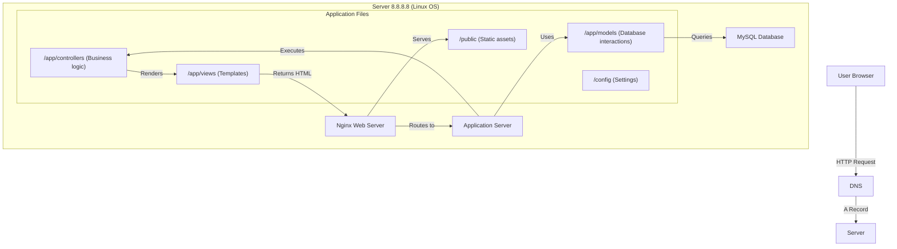

## Designing a Simple Web Stack Infrastructure
The web infrastructure will consist of a single server with a LAMP (Linux, Apache, MySQL, PHP/Perl/Python) stack replaced by Nginx as the web server. The infrastructure will include one server configured with a domain name www.foobar.com. Let us break down the design step by step:

1. User's Journey to Access the Website
Step 1: A user opens their browser and enters www.foobar.com into the address bar.

Step 2: The browser sends a DNS query to resolve www.foobar.com to an IP address (8.8.8.8 in this case).

Step 3: Once resolved, the browser sends an HTTP or HTTPS request to the server at IP address 8.8.8.8.

Step 4: The server processes the request using its web server, application server, and database, and returns the appropriate content (HTML, CSS, JavaScript) to the user.

## 2. Components of the Infrastructure

1. Domain Name (foobar.com)
A human-readable name that points to the server's IP address (8.8.8.8).

Role: Simplifies access to the website for users.

DNS Record: The www subdomain is typically configured using an A record (Address Record) to associate it with the server's IP.

2. The Server
A physical or virtual machine hosting all components of the stack (web server, application server, application code, and database, data center), this server run from os and linux.

Role: Centralized resource that serves the website to users.

3. Web Server (Nginx)
Role: Handles incoming HTTP/HTTPS requests and serves static files (e.g., images, CSS). Forwards dynamic requests to the application server.

Acts as a reverse proxy to manage requests.

4. Application Server
Example: PHP-FPM or Python running Flask/Django.

Role: Executes the business logic, processes user input, and communicates with the database to generate dynamic content.

5. Application Files (Code Base)
Contains the website’s front-end and back-end logic.

Role: Implements the website’s functionality and user interface.

6. Database (MySQL)
Role: Stores and retrieves structured data (e.g., user accounts, blog posts).

Accessible by the application server through SQL queries.

7. Communication
Communication between the user’s computer and the server occurs over HTTP or HTTPS protocols. Secure communication uses HTTPS with SSL/TLS encryption, TCP/IP Connection: Browser establishes connection via HTTP/HTTPS.

3. Issues with the Infrastructure
1. SPOF (Single Point of Failure)
The single server means any failure (hardware/software) will bring the entire website down.

2. Downtime for Maintenance
Deploying new code, updating software, or restarting the web server will result in downtime since there’s no backup server.

3. Scaling Limitations
A single server cannot handle high traffic. If the incoming requests exceed the server’s capacity, users may experience delays or downtime.

## Visual Representation
Here’s a textual representation of the design for the single-server infrastructure:

