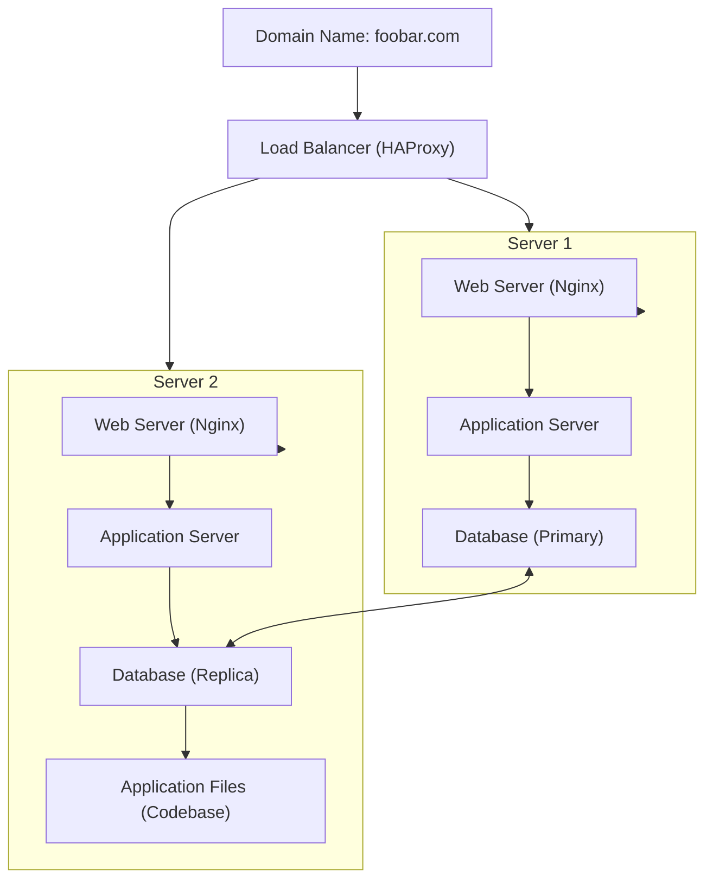

# Distributed Web Infrastructure

## Overview  

This distributed web infrastructure is designed to host the website `www.foobar.com` with the following components:  

1. **1 Load Balancer (HAProxy)**  
2. **2 Servers**, each containing:  
   - A web server (Nginx).  
   - An application server.  
   - Application files (codebase).  
   - A database (MySQL).  

---

## Infrastructure Diagram  

-----

## Explanation of Components  

### 1. **Load Balancer (HAProxy)**  

- **Purpose**:  
  - Distributes incoming traffic evenly across the two servers.  
  - Ensures high availability and resource utilization.  

- **Distribution Algorithm**:  
  - **Round Robin**:  
    - Each incoming request is assigned to the next server in the list, cycling evenly.  
    - Balances the load effectively across servers.  

- **Active-Active vs. Active-Passive**:  
  - **Active-Active**:  
    - Both servers handle requests simultaneously.  
    - This setup maximizes resource usage and improves throughput.  
  - **Active-Passive**:  
    - One server is active and handles all requests.  
    - The second server is on standby for failover.  

  **Setup Used Here**: Active-Active.  

---

### 2. **Two Servers**  

Each server includes the following components:  

#### **Web Server (Nginx)**  
- Handles incoming HTTP/HTTPS requests.  
- Serves static files (e.g., HTML, CSS, JavaScript).  
- Forwards dynamic requests to the application server.  

#### **Application Server**  
- Processes business logic and handles requests forwarded by the web server.  
- Communicates with the database to fetch or store data.  

#### **Application Files (Codebase)**  
- The same synchronized or shared application code exists on both servers to maintain consistency.  

---

### 3. **Database Cluster (Primary-Replica)**  

- **How It Works**:  
  - The **Primary Node (Master)** handles all write operations.  
  - Data changes on the primary node are replicated to the **Replica Node (Slave)**.  
  - The replica node processes read requests to reduce the load on the primary.  

- **Difference Between Primary and Replica**:  
  - **Primary Node**:  
    - Handles both read and write operations.  
  - **Replica Node**:  
    - Handles only read operations to improve performance and availability.  

---

## Issues with the Infrastructure  

| Issue                      | Explanation                                                                                          |
|----------------------------|------------------------------------------------------------------------------------------------------|
| **Single Points of Failure (SPOF)** | The load balancer and the primary database are SPOFs. Their failure would affect the entire infrastructure. |
| **Security Issues**        | Without a firewall or HTTPS, the system is vulnerable to attacks and data interception.             |
| **No Monitoring**          | Without monitoring tools, it’s difficult to detect performance issues, downtime, or replication delays. |

---

## Recommendations for Improvement  

1. **Add Redundancy**:  
   - Use a secondary load balancer with failover (e.g., Keepalived with VRRP).  

2. **Enhance Security**:  
   - Deploy a firewall (e.g., UFW, iptables).  
   - Enable HTTPS using SSL/TLS certificates.  

3. **Implement Monitoring**:  
   - Tools like Prometheus and Grafana can be used for tracking server performance and database health.  

4. **Improve Database Availability**:  
   - Implement automated failover for the database cluster.  