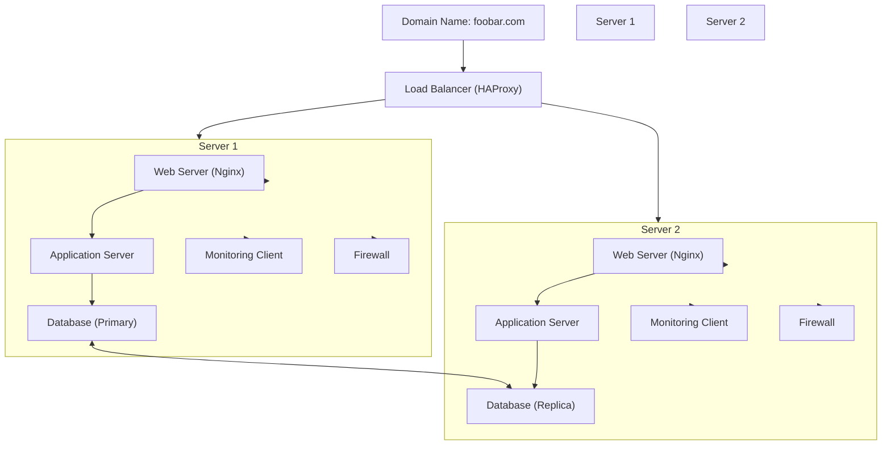

# Secured and Monitored Web Infrastructure

## Overview

This infrastructure is designed to host the website `www.foobar.com` with enhanced security, encrypted traffic, and monitoring capabilities. The infrastructure includes the following components:

1. **1 Load Balancer (HAProxy)**  
2. **3 Firewalls**  
3. **1 SSL Certificate**  
4. **2 Servers**, each containing:  
   - A web server (Nginx).  
   - An application server.  
   - Application files (codebase).  
   - A database (MySQL).  
   - Monitoring clients for data collection.  

---

## Infrastructure Diagram


---

## Explanation of Components

### 1. **Firewalls**  
- **Purpose**:  
  - Protect the servers and the load balancer from unauthorized access.  
  - Filter incoming and outgoing traffic based on predefined rules.  
  - Block malicious traffic (e.g., DDoS attacks, port scans).  

### 2. **SSL Certificate**  
- **Purpose**:  
  - Encrypts traffic between users and the website.  
  - Provides secure HTTPS connections to prevent data interception.  
  - Increases trustworthiness and SEO ranking.  

### 3. **Monitoring Clients**  
- **Purpose**:  
  - Collect data on server performance, application health, and traffic patterns.  
  - Send logs and metrics to a monitoring service (e.g., Sumo Logic, Datadog, or Prometheus).  

- **Data Collection**:  
  - Monitoring tools collect metrics such as CPU usage, memory consumption, disk space, and requests per second (QPS).  
  - Log files from web servers, application servers, and databases are analyzed for anomalies and errors.  

---

## Monitoring the Web Server QPS

- **Steps to Monitor QPS**:  
  1. Configure the monitoring client to capture logs from the web server (Nginx).  
  2. Enable the Nginx access log with details about each request.  
  3. Use the monitoring service to parse logs and calculate the number of requests per second.  
  4. Visualize QPS in a dashboard for real-time insights.  

---

## Issues with This Infrastructure

| **Issue**                                | **Explanation**                                                                                  |
|------------------------------------------|--------------------------------------------------------------------------------------------------|
| **SSL Termination at the Load Balancer** | The connection between the load balancer and the backend servers remains unencrypted.            |
| **Single Write-Capable MySQL Server**    | The primary server handles all write requests, creating a bottleneck and potential SPOF.         |
| **Identical Components on All Servers**  | If a vulnerability or failure affects one component (e.g., database), all servers may be impacted. |

---

## Recommendations for Improvement

1. **SSL Termination**:  
   - Use end-to-end encryption by enabling HTTPS on both the load balancer and backend servers.  

2. **Database Setup**:  
   - Introduce multiple write-capable nodes using a cluster solution like Galera or CockroachDB to improve scalability and fault tolerance.  

3. **Component Separation**:  
   - Separate components (e.g., database, application server, web server) onto different servers to reduce shared vulnerabilities and improve maintainability.  

4. **Enhanced Monitoring**:  
   - Implement alerting for critical metrics (e.g., QPS thresholds, CPU spikes).  
   - Use tools like Grafana for detailed visualization of performance metrics. 


   ```mermaid
graph TD
    subgraph Load Balancer Cluster
        LB1["Load Balancer 1 (HAProxy)"]
        LB2["Load Balancer 2 (HAProxy)"]
        LB1 --- LB2
    end

    subgraph Web Servers
        WS1["Web Server 1 (Nginx)"]
        WS2["Web Server 2 (Nginx)"]
        LB1 --> WS1
        LB1 --> WS2
        LB2 --> WS1
        LB2 --> WS2
    end

    subgraph Application Servers
        App1["Application Server 1"]
        App2["Application Server 2"]
        WS1 --> App1
        WS2 --> App2
    end

    subgraph Database Cluster
        DBPrimary["Primary MySQL Server"]
        DBReplica1["Replica MySQL Server 1"]
        DBReplica2["Replica MySQL Server 2"]
        App1 --> DBPrimary
        App2 --> DBPrimary
        DBPrimary --- DBReplica1
        DBPrimary --- DBReplica2
    end