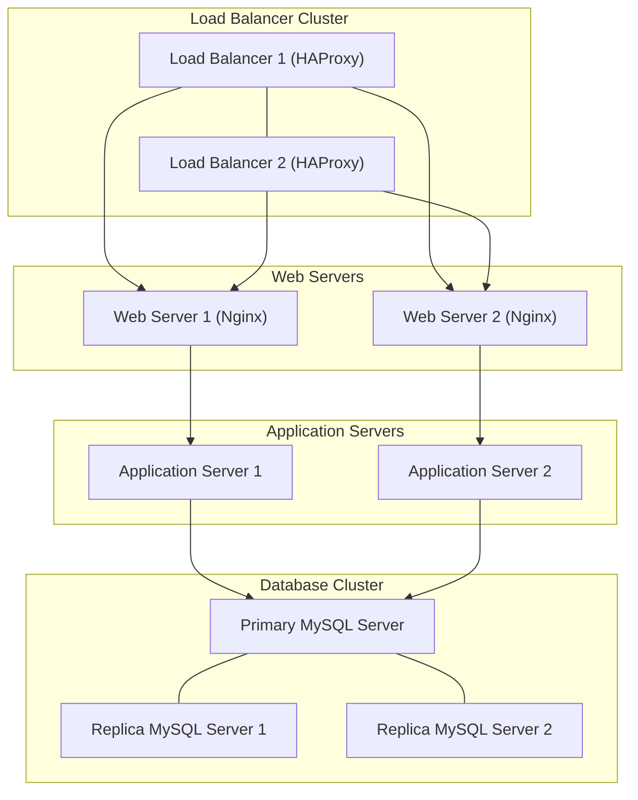

# Scaled Up Web Infrastructure Design

## Architecture Overview

## Components

### 1. Load Balancer Cluster (HAProxy)
**Purpose**: Provide high availability load balancing with automatic failover.

**Components**:
- Primary Load Balancer: Active node handling traffic
- Secondary Load Balancer: Standby node for failover
- Keepalived: Manages VIP (Virtual IP) and failover

**Benefits**:
- Eliminates single point of failure
- Automatic failover ensures zero downtime
- Improved reliability and fault tolerance

### 2. Web Servers (Nginx)
**Purpose**: Serve static content and terminate SSL connections.

**Responsibilities**:
- Deliver static files (HTML, CSS, JS, images)
- Handle SSL/TLS termination
- Perform basic HTTP request routing and caching

**Benefits**:
- Reduces load on application servers
- Optimized for static content delivery
- Enhances security via SSL termination
- Improves performance through caching

### 3. Application Servers
**Purpose**: Execute business logic and generate dynamic content.

**Responsibilities**:
- Run application code
- Process dynamic requests
- Manage application state

**Benefits**:
- Dedicated resources for application processing
- Allows horizontal scaling of business logic
- Simplifies maintenance and updates

### 4. Database Servers
**Purpose**: Store and manage persistent data.

**Components**:
- Primary MySQL server handles writes
- Replica servers handle reads to improve performance

**Benefits**:
- Enhances read scalability and availability
- Provides data redundancy and failover
- Enables backups without impacting primary operations

## Key Advantages

### Separation of Concerns
- Each component specializes in a specific role
- Easier to scale and maintain independently
- Improved resource utilization
- Simplified debugging and troubleshooting

### High Availability
- HAProxy cluster eliminates single points of failure
- Database replication provides redundancy
- Automatic failover ensures minimal downtime

### Scalability
- Components can be scaled horizontally based on demand
- Independent scaling of web, application, and database layers
- Balanced traffic distribution

### Performance
- Each component optimized for its task
- Reduced contention for resources
- Efficient caching and SSL termination
- Improved response times

## Component Comparison

### Web Server (Nginx) vs Application Server

| Feature          | Web Server (Nginx)               | Application Server              |
|------------------|----------------------------------|---------------------------------|
| Primary Function | Serve static content and handle SSL | Execute application code and business logic |
| Key Responsibilities | HTTP/HTTPS requests, static files, SSL termination, routing, caching | Dynamic content processing, application workflows, database connections |
| Best Use Case    | Efficient static content delivery | Handling dynamic web applications |

## Recommendations for Improvement

### Load Balancing
✅ Implement health checks  
✅ Enable session persistence if needed  
✅ Configure SSL passthrough  
✅ Apply rate limiting for protection  

### Web Servers
✅ Use CDN for global content delivery  
✅ Add Web Application Firewall (WAF)  
✅ Optimize caching policies  
✅ Enable compression for bandwidth saving  

### Application Servers
✅ Use containerization (Docker, Kubernetes)  
✅ Enable auto-scaling  
✅ Configure internal load balancing  
✅ Monitor application health and metrics  

### Database Servers
✅ Use connection pooling  
✅ Optimize slow queries  
✅ Set up regular backups  
✅ Monitor performance and replication status  
